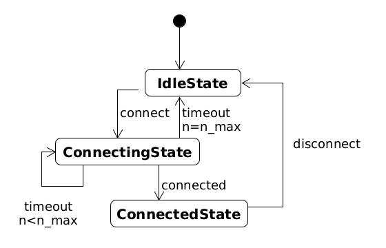
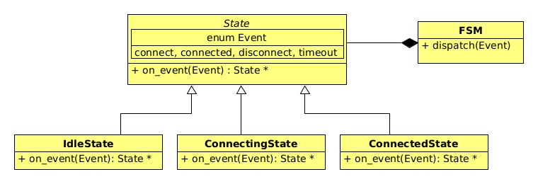
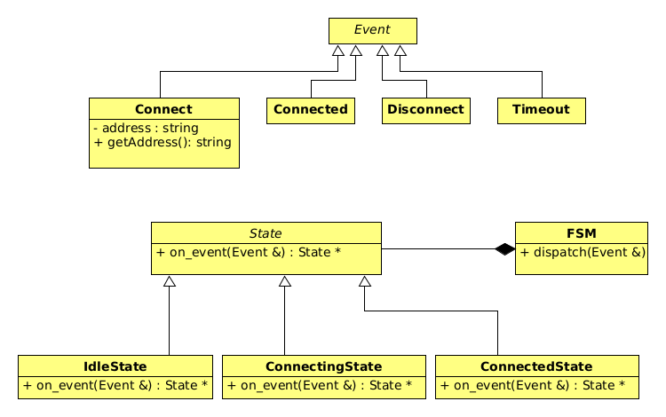

U ovom zadatku u nizu koraka konstruiramo jednostavan konačni automat. 

**Zadatak 1**.

**Konačni automat**  se sastoji od 3 stanja. Tranzicije iz pojedinih stanja se dešavaju kao 
odgovor na vanjske događaje. Ovdje je prikaz stanja i tranzicija:



Događaji ne prenose nikakvu dodatnu informaciju te mogu biti implementirani kao jedna 
enumeracija. Imamo sljedeće događaje: 
*connect*, *connected*, *disconnect* i *timeout*. S *connect* iz **IdleState** prelazimo u 
**ConnectingState** stanje. Povezivanje ne mora uspjeti i moguće da se javi *timeout*
događaj koji se tolerira najviše `n_max` puta. Dok maksimalan broj neuspjeha nije
dosegnut automat ostaje u **ConnectingState** stanju. Kada se signal *timeout* emitira 
`n_max` puta automat prelazi u **IdleState**. Događaji *connected* i *disconnect* 
induciraju prijelaze stanja kao na slici: *connected* prebacuje automat iz **ConnectingState** u
**ConnectedState**, a *disconnect* prebacuje automat iz **ConnectedState** u **IdleState**.

Ovdje je dijagram klasa za cijeli sustav:



Klasa **FSM** (*finite state machine*) drži pokazivač na trenutno stanje. Dodijeljeni konstruktor
inicijalizira pokazivač s **IdleState**.  Ima jednu metodu `dispatch(Event)` koja uzima događaj i mijenja
stanje automata u ovisnosti o događaju. 

Implementacijski detalji:

- Stanja se kreiraju dinamički i njihov životni vijek je kontroliran sa `std::unique_ptr<State>`
  klasom. U programu nema *golih* pokazivača.
- `on_event(Event)` metode u klasama stanja mijenjaju trenutno stanje vraćanjem pokazivača na 
  novo stanje. Pri tome ne vraćaju goli pokazivač već `std::unique_ptr<State>`. 
- U situaciji u kojoj stanje ne reagira na događaj metoda  `on_event(Event)` može vratiti `nullptr`. 
- Korištenjem mehanizma virtualnih funkcija klasa **FSM** ostaje neovisna o konkretnom tipu stanja koje drži.
  Jedino konstruktor mora kreirati **IdleState** stanje. Dodavanje novih stanja ne mijenja **FSM**.

U implementaciji treba ispisivati sve promjene stanja. Kod za testiranje je dan u glavnoj datoteci:

```c++
template <typename... Events>
void dispatch(FSM & fsm, Events... events){
	(fsm.dispatch(events),...);
}

int main(){
	FSM fsm;
	dispatch(fsm, State::connect, State::timeout, State::timeout, State::timeout, 
			 State::connect, State::connected, State::disconnect, State::connect, State::timeout,
			 State::connected, State::disconnect);
	return 0;
}
```
Kod treba dati ispis oblika:

```
IdleState->ConnectingState
ConnectingState->ConnectingState
ConnectingState->ConnectingState
ConnectingState->IdleState
IdleState->ConnectingState
ConnectingState->ConnectedState
ConnectedState->IdleState
IdleState->ConnectingState
ConnectingState->ConnectingState
ConnectingState->ConnectedState
ConnectedState->IdleState
```

**Zadatak 2**.

U prethodnom zadatku događaji nisu sa sobom nosili nikakvu informaciju i stoga smo ih 
mogli implementirati kao elemente enumeracije smještene unutar **State** klase. Pretpostavimo sada 
da (neki) događaji mogu prenositi informacije. Na primjer događaj `connect` nosi informaciju 
o adresi na koju se spaja. U toj situaciji događaje moramo predstaviti kao objekte te ćemo stoga 
definirati klase koje predstavljaju događaje.  U skladu s objektnim pristupom sve klase događaja
će proširivati apstraktnu baznu klasu **Event** i klijenti događaja će uzimati referencu na 
baznu klasu kako bi mogli raditi sa svim vrstama događaja. Ovdje je novi dijagram klasa:



Članove enumeracije *connect*, *connected*, *disconnect* i *timeout* zamijenjuju konkretne klase 
**Connect**, **Connected**, **Disconnect** i **Timeout**.
Uočimo da struktura koda ostaje ista s time da kod oblika 

```c++
std::unique_ptr<State> IdleState::on_event(Event e){ 
  if(e == Event::connect){ 
    // ...
  }
  // ... 
} 
```

moramo zamijeniti s kodom oblika 

```c++
std::unique_ptr<State> IdleState::on_event(Event const & e){ 
  if(dynamic_cast<const Connect *>(&e)){ 
    // ...
  }
	// ... 
}
```
Modificirajte program tako da radi kao i u prvoj verziji s time da pri događaju 
**Connect** ispisuje adresu konekcije. Glavni program je 

```c++
template <typename... Events>
void dispatch(FSM & fsm, Events... events){
	(fsm.dispatch(events),...);
}

int main(){
	FSM fsm;
	dispatch(fsm, Connect{"www.test.com"}, Timeout{}, Timeout{}, Timeout{}, 
			 Connect{"www.google.com"}, Connected{}, Disconnect{}, Connect{"web.math.hr"}, 
			 Timeout{}, Connected{}, Disconnect{});
	return 0;
}
```

a ispis je oblika:

```
IdleState->ConnectingState ("www.test.com")
ConnectingState->ConnectingState
ConnectingState->ConnectingState
ConnectingState->IdleState
IdleState->ConnectingState ("www.google.com")
ConnectingState->ConnectedState
ConnectedState->IdleState
IdleState->ConnectingState ("web.math.hr")
ConnectingState->ConnectingState
ConnectingState->ConnectedState
ConnectedState->IdleState
```


**Zadatak 3**. 

Prethodna verzija koda ne skalira se dobro (zamislite veliki broj stanja i konekcija). 
Stoga treba napraviti novu verziju koda koja 
će izbjeći korištenje `dynamic_cast<>` operatora unutar `if` naredbi. Da bismo detektirali 
problem pogledajmo što se dešava kada na `FSM` objektu pozovemo `dispatch()` metodu. 
`FSM` objekt sadrži pokazivač na konkretno stanje, statičkog tipa `State *`, na kojem može 
pozvati `on_event(Event &)` metodu koja dobiva referencu na objekt tipa **Event** kao 
argument. Poziv kroz pokazivač proslijeđuje se konkretnom stanju jer je metoda 
`on_event(Event &)` virtualna. U konkretnom stanju metoda 
`on_event(Event &)` treba konkretan tip događaja da bi vratila novo stanje, ali informacija
o tipu događaja je izgubljena jer imamo samo referencu na tip bazne klase (`Event`). U Zadatku 2 
smo taj problem riješili pomoću `dynamic_cast<>` operatora, što ovdje želimo izbjeći. 
Ono što nam treba je **double dispatch**. Pozvana metoda `on_event()` mora ovisiti stvarnom tipu stanja 
i stvarnom tipu događaja. Na referenci tipa `Event` moramo stoga pozvati virtualnu funkciju koja 
će pozvati implementaciju iz konkretne *event*-klase. Stoga je ovo mjesto za **oblikovni obrazac vizitor**.

Rekonstruirajte kod koristeći vizitor oblikovni obrazac. Glavni program je isti kao u Zadatku 2 i 
treba dati isti ispis. 

**Zadatak 4**. 

Prethodnu verziju konačnog automata treba implementirati korištenjem klase `std::variant<>` i funkcije 
`std::visit()`. Eliminirati nasljeđivanje klasa raditi s međusobno neovisnim objektima.
Glavni program ostaje isti i mora dati isti rezultat.

